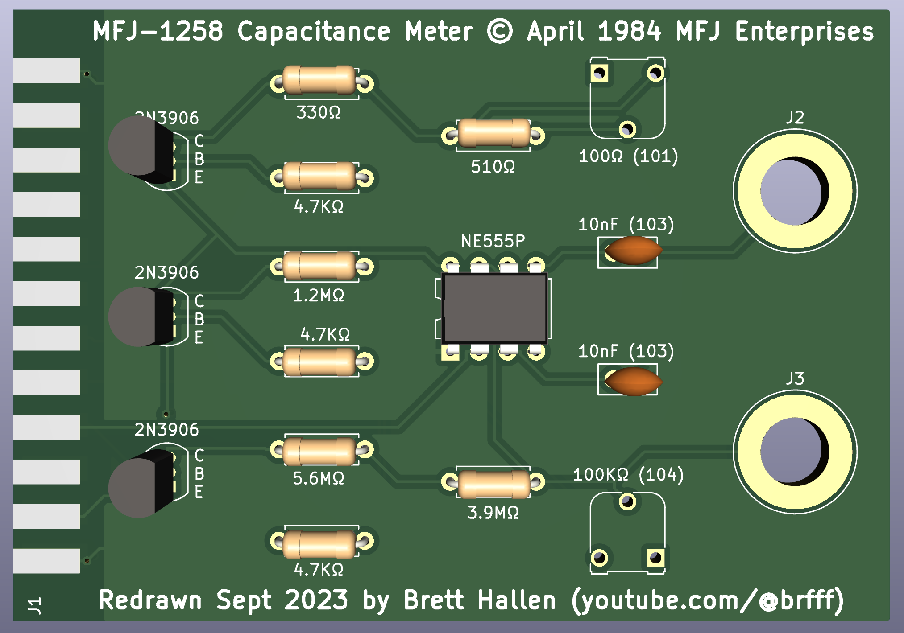

# MFJ-1258 Capacitance Meter for Commodore VIC-20

This piece of hardware was released in 1984 by MFJ Enterprises. 

There is obviously no good reason to boot up your VIC-20, load the program and then measure a
capacitor ... there are much faster ways to do it. 

It is here mainly for education, showing how to interface software and hardware via the User Port. 

I have re-drawn the schematic from the physical board - it is currently UNTESTED! 

Commodore User Port symbol & footprint from [Hackup's Github](https://github.com/hackup/HackupNet-KiCad-Libraries). 

If I do get the board made and it works, I will update this README. 

All errors are my own. 