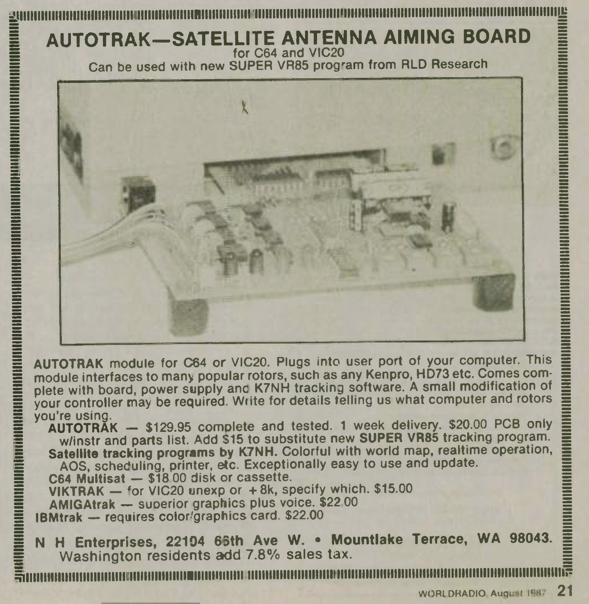

Three versions of K7NH's (Neil Hill) satellite tracking program for the Commodore VIC-20.<br>
[1] VIKTRAK-MAP (unexpanded VIC)<br>
[2] VIKTRAK 2.1 (unexpanded VIC)<br>
[3] VIKTRAK+ 1.3 (8KB or more expanded VIC)<br>
[3] VIKTRAK+ 3KB (patched version for 3KB expanded VIC, see below)<br>
<br>
This program (VIKTRAK+) comes set up for 8KB or more of extra memory. It can be used with 3KB expanded memory by making these changes:<br>
- Line 43: change 4404 to 7988
- Line 44: change 33792 to 30720

```
43 U%=4404-INT((U+50)/10)*22:S%=S%+U%
44 POKE S%,96:POKE S%+33792,1:FOR L=1 TO 9:GET A$:ON-(A$<>"") GOTO 54:NEXT
```

Photos of the AUTOTRAK hardware unit that connects to the VIC-20's expansion port, for controlling the orientation of an antenna.<br>


